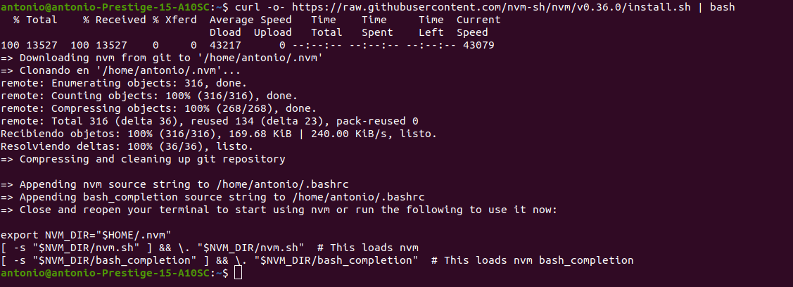
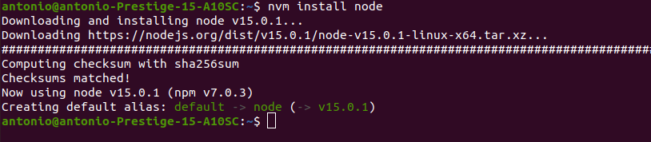
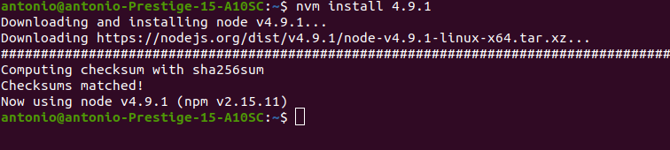
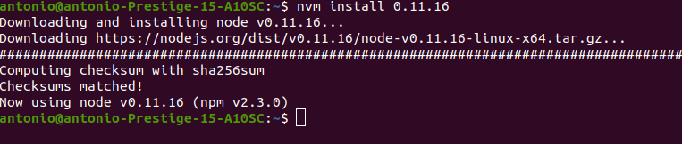

# EJERCICIO 1 - Instalar alguno de los entornos virtuales de node.js (o de cualquier otro lenguaje con el que se esté familiarizado) y, con ellos, instalar la última versión existente, la versión minor más actual de la 4.x y lo mismo para la 0.11 o alguna impar (de desarrollo).

El primer paso sería installar un entorno virtual de node.js, en este caso se ha instalado nvm.

Tras tener nvm instalado ya podemos instalar node.js, en esta primera instalación se instalará la versión mas actual, en este caso la versión 15.0.1, para ello se usa el comando de nvm install pasándole como parámetro node

El siguiente paso es instalar la versión minor mas actual de la 4.x, para ello usamos el comando install de nvm directamente con la versión requerida, en este caso la 4.9.1

Y por último hacemos lo mismo con la versión 0.11.16

