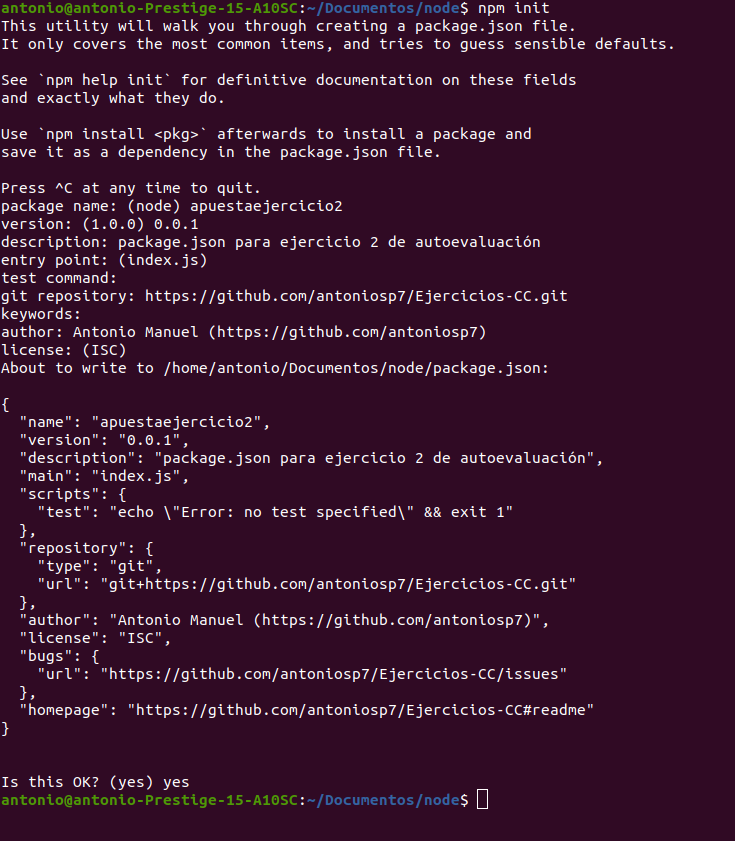
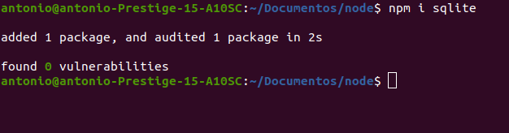

# EJERCICIO 2 - Crear una descripción del módulo usando package.json. En caso de que se trate de otro lenguaje, usar el método correspondiente.

Para crear la descripción del módulo usaremos el comando de npm init y se nos creará el archivo package.json.



Una vez creados se pueden seguir instalando dependencias, por ejemplo sqlite.



Finalmente el archivo package.json quedaría de la siguiente manera.

``` {
  "name": "apuestaejercicio2",
  "version": "0.0.1",
  "description": "package.json para ejercicio 2 de autoevaluación",
  "main": "index.js",
  "scripts": {
    "test": "echo \"Error: no test specified\" && exit 1"
  },
  "repository": {
    "type": "git",
    "url": "git+https://github.com/antoniosp7/Ejercicios-CC.git"
  },
  "author": "Antonio Manuel (https://github.com/antoniosp7)",
  "license": "ISC",
  "bugs": {
    "url": "https://github.com/antoniosp7/Ejercicios-CC/issues"
  },
  "homepage": "https://github.com/antoniosp7/Ejercicios-CC#readme",
  "dependencies": {
    "sqlite": "^4.0.15"
  }
} 
```


