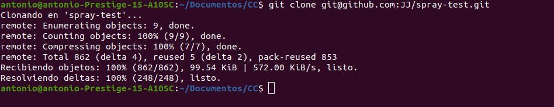
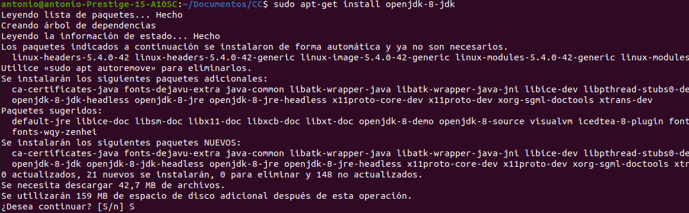
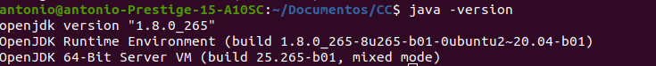
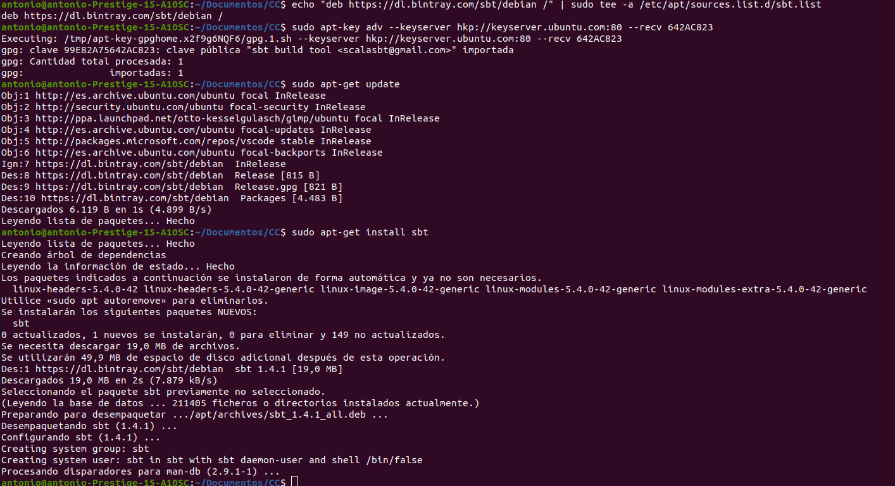
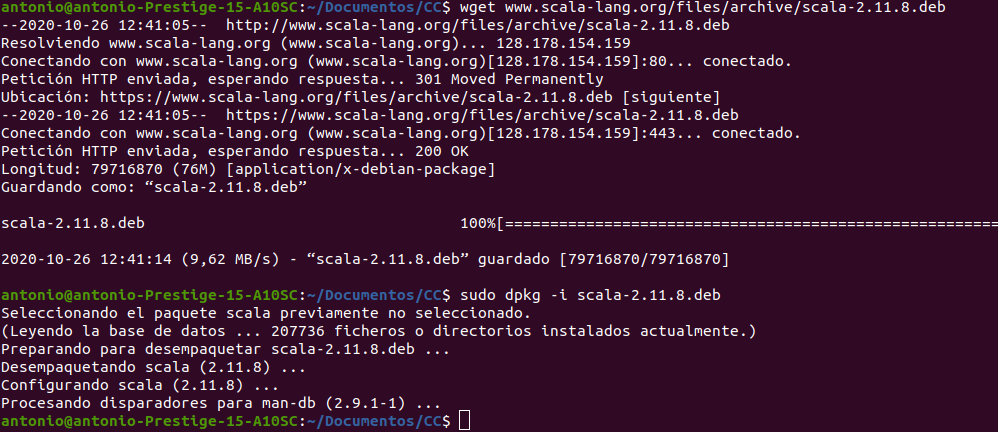
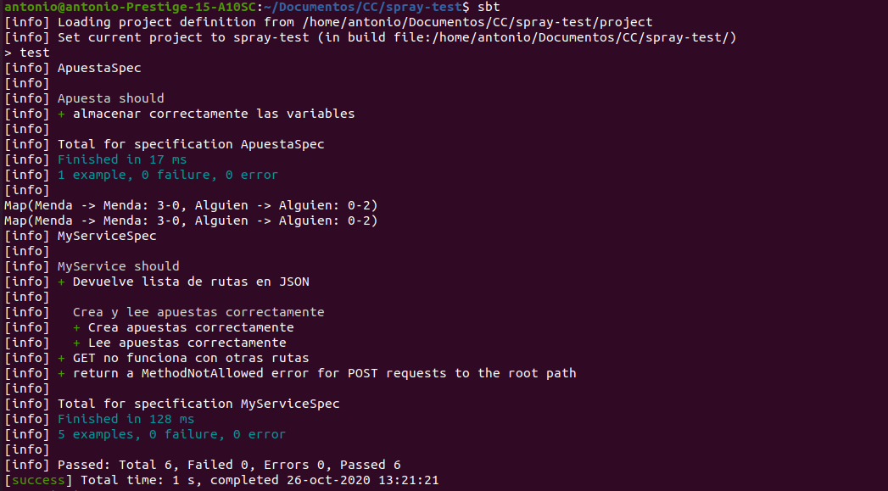
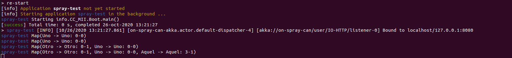
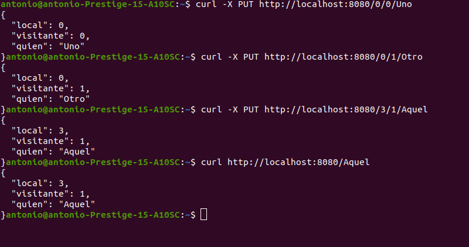

# Ejercicio 3 - Descargar el repositorio de ejemplo anterior, instalar las herramientas necesarias (principalmente Scala y sbt) y ejecutar el ejemplo desde sbt. Alternativamente, buscar otros marcos para REST en Scala tales como Finatra o Scalatra y probar los ejemplos que se incluyan en el repositorio.

El primer paso será clonar el repositorio que se menciona en el anunciado

Posteriormente instalamos jdk 1.8.

Una vez instalado comprobamos que la versión instalada es la correcta.

Tras esto instalamos scala y sbt tal y como vemos [en esta guía](https://gist.github.com/nmfzone/2dc02fb73f30c47faf39005bd21d6331) .

Ahora seguimos los pasos que nos indica el repositorio, primero ejecutamos sbt y posteriormente compilamos y corremos los test.

Si lo completa exitosamente ejecutamos el comando re-start y vemos que se ha desplegado correctamente en http://localhost:8080

Por último ejecutamos las pruebas que existen en el repositorio clonado para comprobar el correcto funcionamiento.

