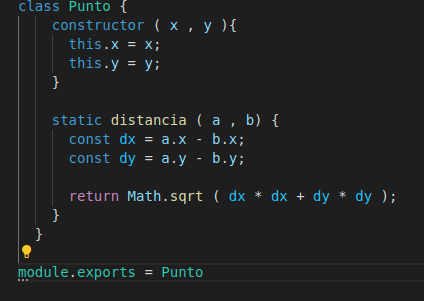
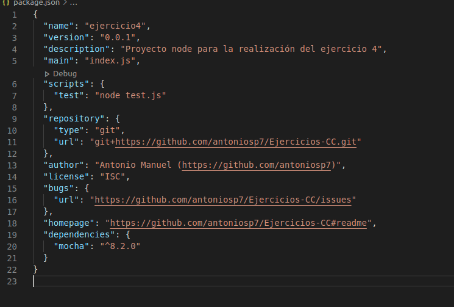
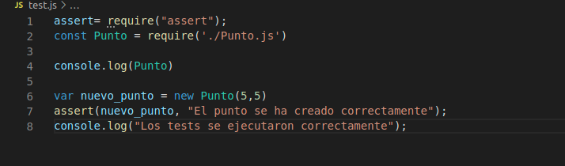
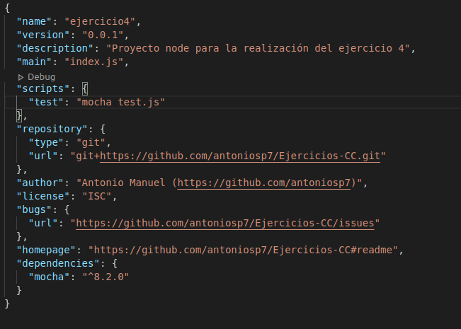
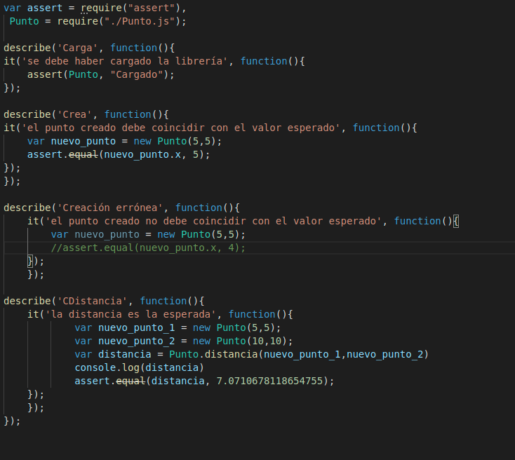
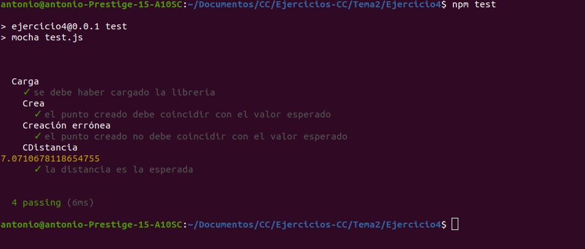
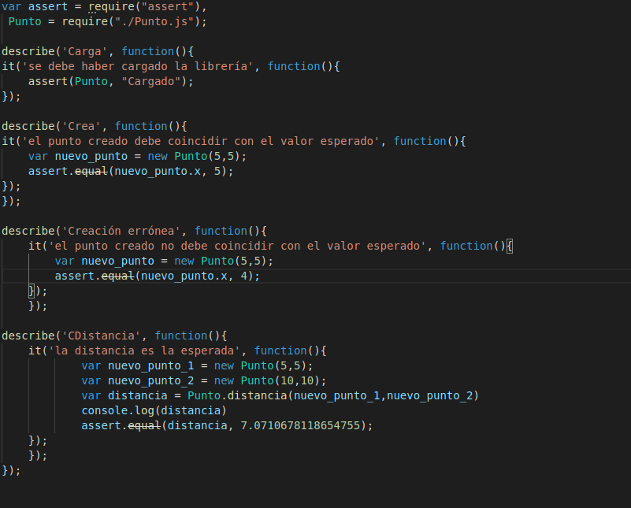
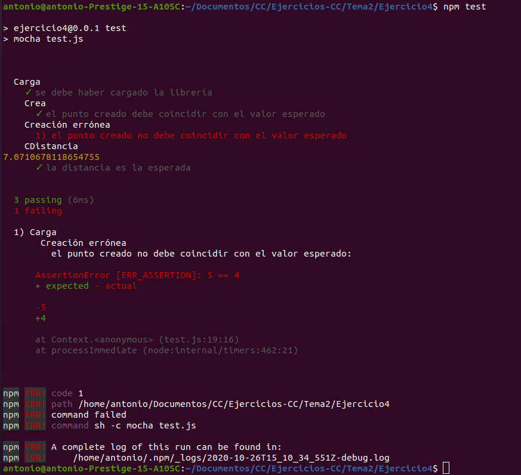

# Ejercicio 4 - Para la aplicación que se está haciendo, escribir una serie de aserciones y probar que efectivamente no fallan. Añadir tests para una nueva funcionalidad, probar que falla y escribir el código para que no lo haga. A continuación, ejecutarlos desde mocha (u otro módulo de test de alto nivel), usando descripciones del test y del grupo de test de forma correcta. Si hasta ahora no has subido el código que has venido realizando a GitHub, es el momento de hacerlo, porque lo vamos a necesitar un poco más adelante.

Al no disponer de código respecto a la aplicación a realizar se ha realizado una pequeña clase Punto recogida de la [página oficial de javascript](https://developer.mozilla.org/es/docs/Web/JavaScript/Referencia/Classes).

Este sería el código respecto al cual vamos a realizar las pruebas.

El primer paso sería crear un archivo 'test.js' y configurar 'package.json'.

Siguiendo el ejemplo dado en el material de la asignatura crearemos un test simple que compruebe que la librería ha sido cargada correctamente

Ahora configuraremos mocha, el primer paso es instalarlo y una vez lo tengamos cambiaremos el 'package.json' para que lo use al ejecutar los test.

Para usar mocha habría que cambiar el archivo 'test.js' de la siguiente manera, las pruebas realizadas son de correcto establecimiento de la variable x y otra que comprueba que la funcionalidad que realiza entre la distancia entre los puntos es correcta. Pondremos una prueba que debe fallar pero de momento se comentará para ver como sería el resultado en el terminal de los test correctos.

Así se mostraría si todo hubiera salido bien. A continuación descomentaré el test que debe fallar para mostrar como se mostraría un test fallido.

