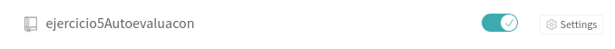
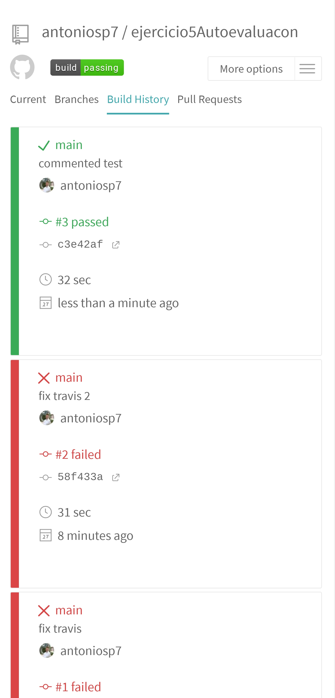

# Ejercicio 5: Haced los dos primeros pasos antes de pasar al tercero.

El repositorio usado para este ejercicio [estará aquí ](https://github.com/antoniosp7/ejercicio5Autoevaluacon).

El primer paso será una vez inicado sesión en travis, añadir el repositorio al marco de trabajo.

Tras esto creamos el archivo .travis.yml y realizamos un commit para que se ejecuten los test en Travis

La imagen mostrada es a través de la interfaz del teléfono móvil ya que la versión web de Travis no actualizaba las build, y como podemos ver ha pasado la build y se han ejecutado con éxito los tres tests.

